# Budget
A budgeting app that records income and expenses。

一个记账应用，语言主要为Kotlin，Java用于一部分工具类。

# Screen Shots

## Theme Blue

    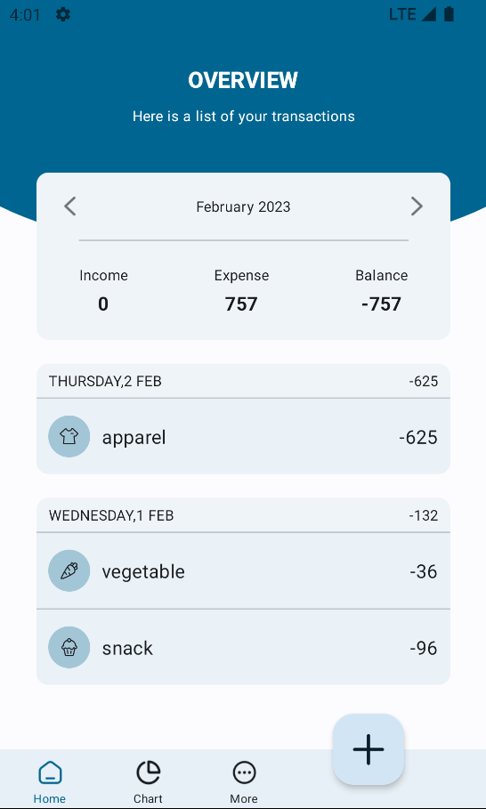
    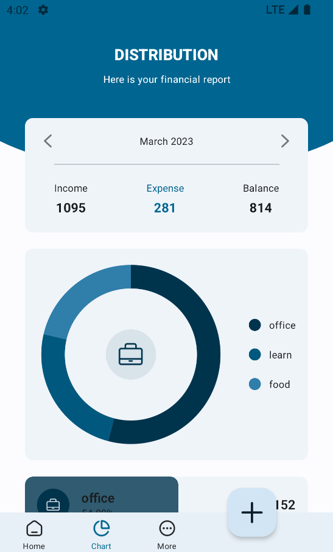
    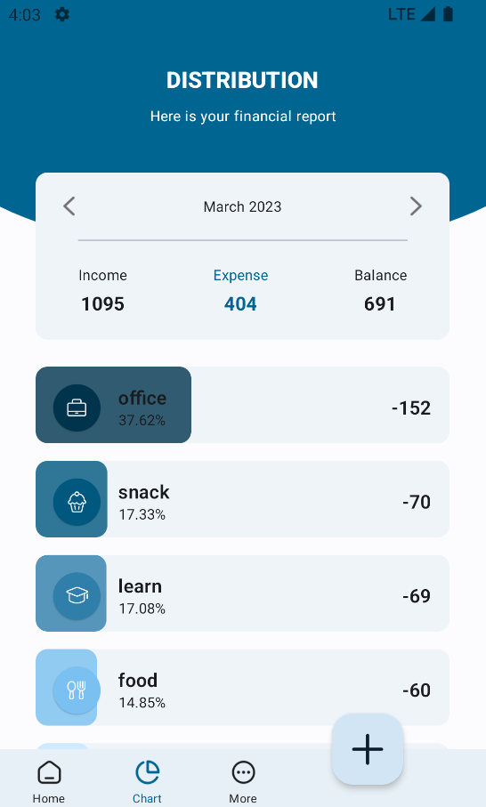

---

    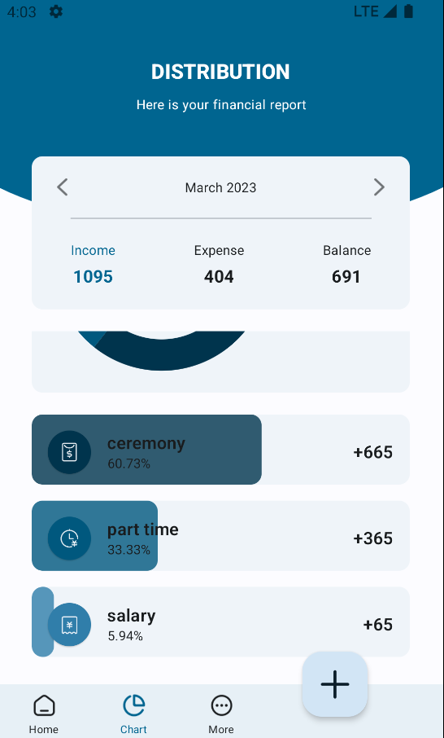
    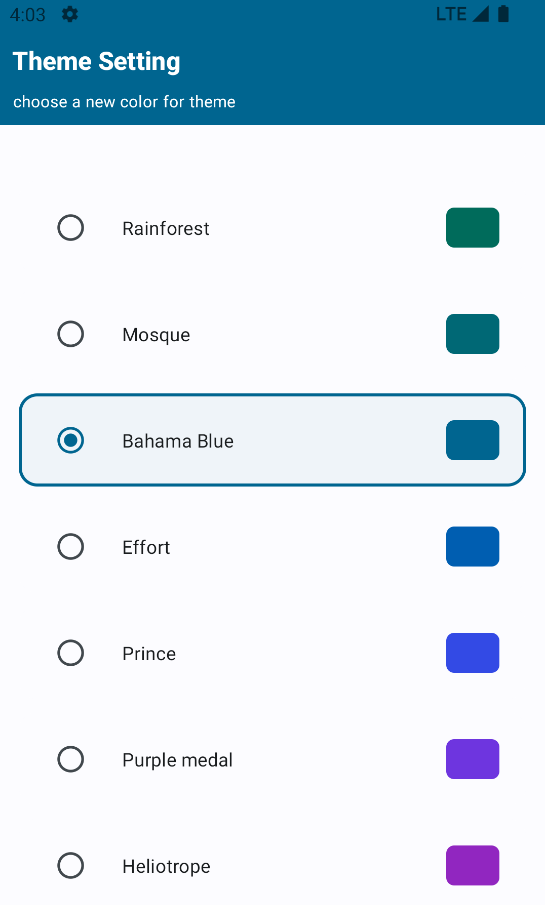
    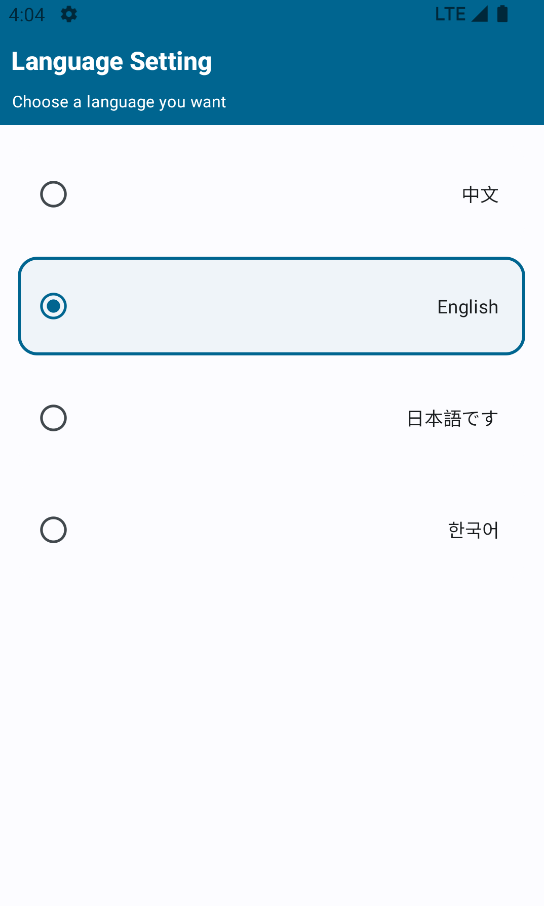

---

    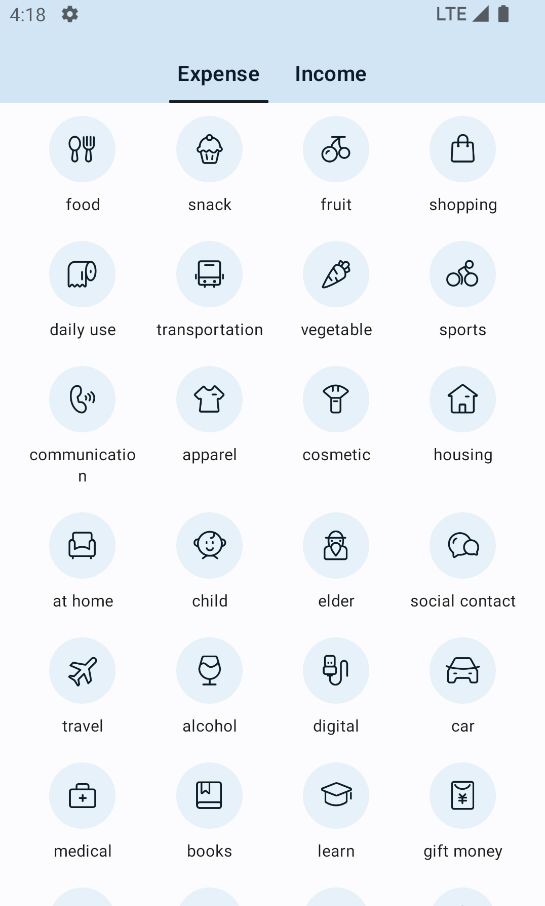
    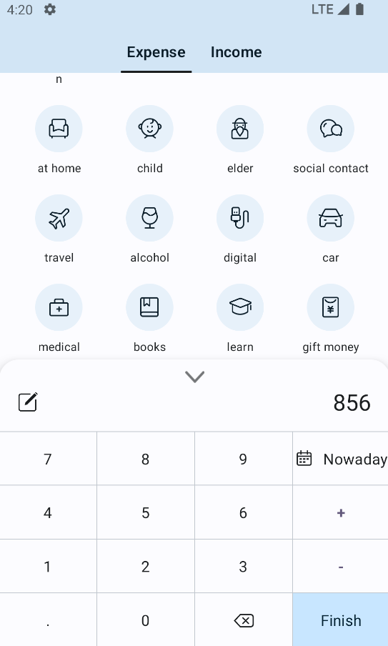
    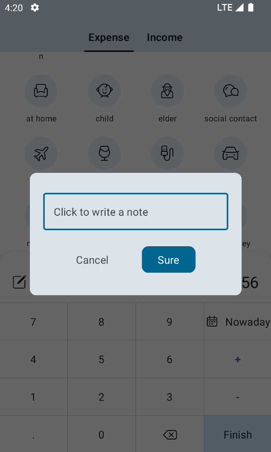

---

    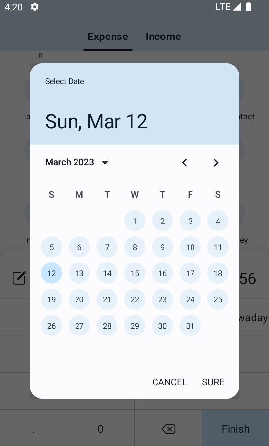
    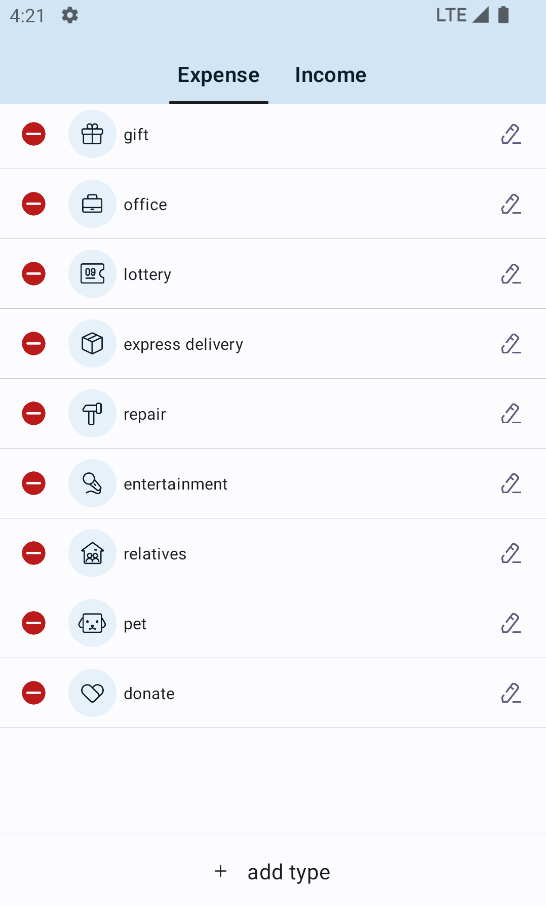
    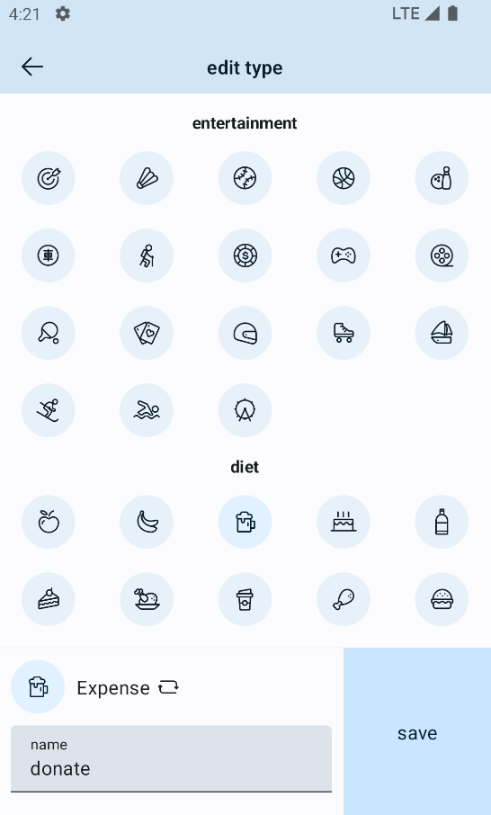

---

    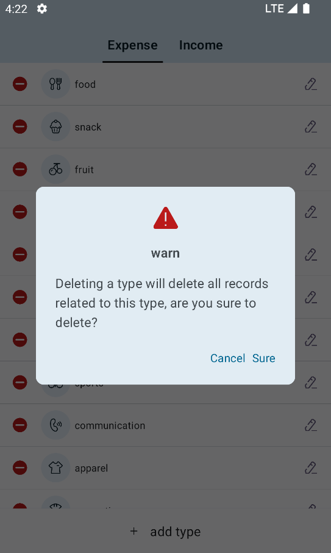
    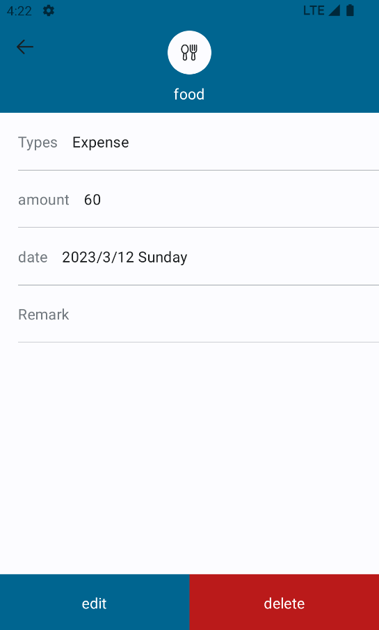

> 还有其它主题色，在右边 [release](https://github.com/JeckOnly/Budget/releases) 栏下载 apk ，可以尽情玩耍该应用

# Multi Module

采用多模块设计，解耦合。架构设计学习自 Google NowInAndroid 项目。[NowInAndroid Architecture](https://github.com/android/nowinandroid/blob/main/docs/ModularizationLearningJourney.md)

    
    

# Library

这里列出一些用到的库

### UI

- Jetpack Compose
  - 基础
  - Constraint Layout
  - Material Design 3
  - Compose Navigation
  - Accompanist
    - Systemuicontroller
    - Pager
    - Navigation animation
  - Lottie
  - 列表的拖动排序框架 "org.burnoutcrew.composereorderable:reorderable"

### 依赖注入框架

- Hilt

### 数据存储框架

- Room
- DataStore protobuf

### 日志框架

- Timber

以及从 [Material Design 3算法库](https://github.com/material-foundation/material-color-utilities) copy 了一些算法相关的源代码。

